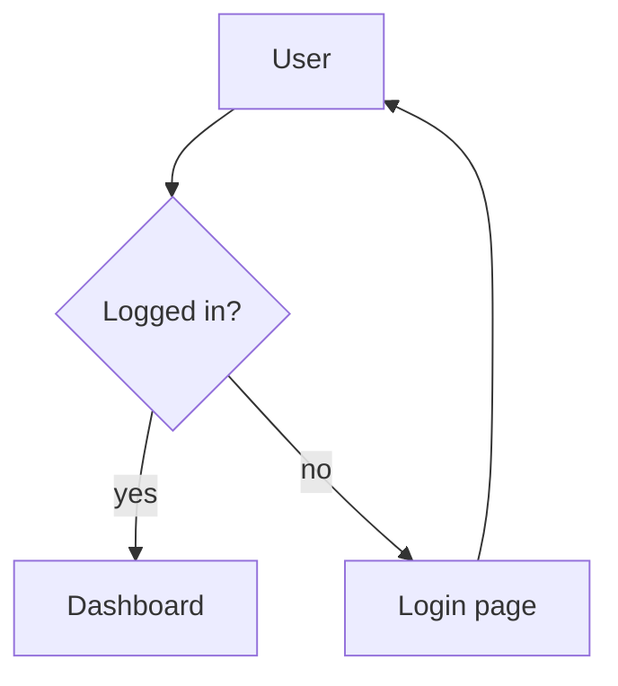
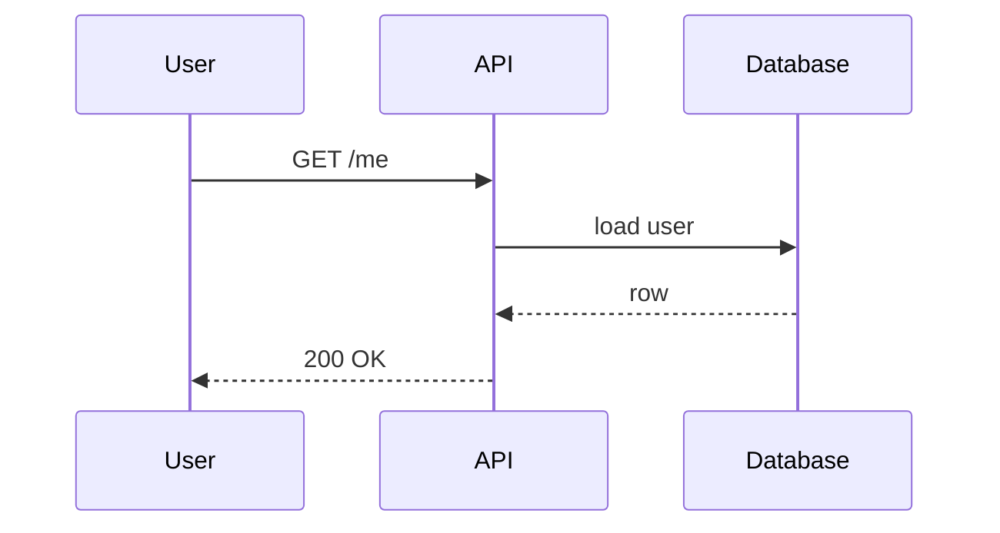

# Mermaid sample

A short tour of the diagram types printr renders.

## Flowchart



## Sequence



## Broken diagram

This one has a syntax error on purpose so you can see the fallback:

```mermaid
graph TD
  A --> B
  C --
```

The block above should print as labelled source code rather than a diagram.
