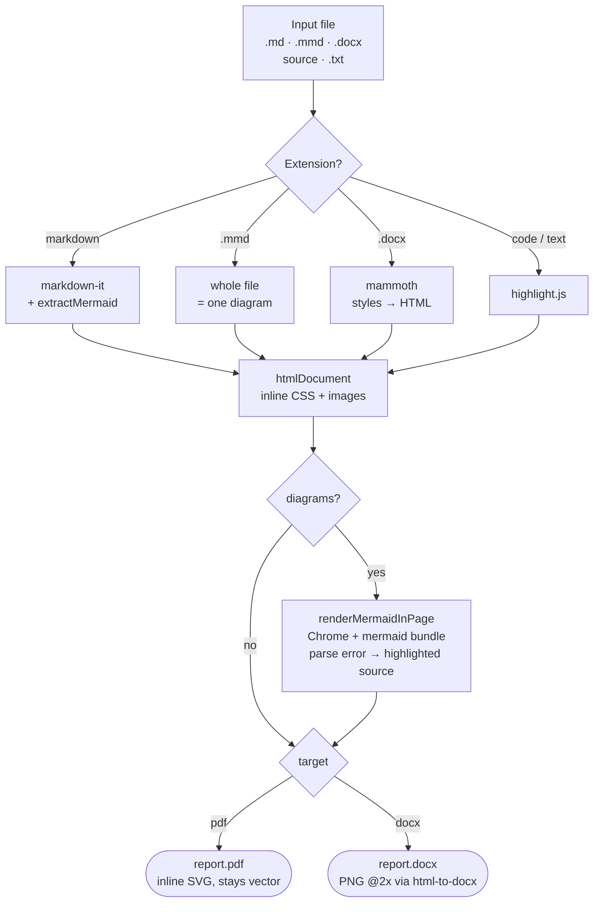

# printr sample

A quick document to verify rendering.

## Features

- GitHub-style typography
- Syntax-highlighted code
- Tables and blockquotes

> Markdown in, polished PDF out.

```ts
function greet(name: string): string {
  return `Hello, ${name}!`;
}
console.log(greet("world"));
```

| Input  | Output   |
| ------ | -------- |
| `.md`  | styled   |
| `.txt` | verbatim |

Some inline `code` and a [link](https://example.com).


## How printr renders a file


